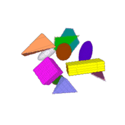

<h1 align="center"> 3D Mask R-CNN </h1>

Based on the [2D implementation](https://github.com/matterport/Mask_RCNN) by Matterport, Inc, [this update](https://github.com/ahmedfgad/Mask-RCNN-TF2) and [this fork](https://github.com/matterport/Mask_RCNN/pull/1611/files).

This 3D implementation was written by Gabriel David (LIRMM, Montpellier, France). Most of the code inherits from the MIT Licence edicted by Matterport, Inc (see core/LICENCE).

This repository is linked to the paper:

We adopt a Docker approach to simplify the distribution and reproduction of our work. Running this 3D Mask R-CNN without our image is possible but requires to install TensorFlow sources and to compile the 3D Non Max Suppression and 3D Crop And Reisze custom operations by hand.

# Phallusia mammillata Dataset

This section aims to reproduce the results of the paper mentioned above on the PM dataset. Please follow the default commands below.

Representations of pair ground truth instance segmentation and input image:

<p align="center">
    
</p>

Clone this repository and access cloned directory with:

```
git clone https://github.com/gdavid57/3d-mask-r-cnn.git
cd 3d-mask-r-cnn
git checkout -b morphogenesis
```

See the main branch for extensive details.

## Data

Data are hosted on figshare: [here](https://figshare.com/account/projects/220273/articles/26973085). The user is expected to download all these files and to unzip them in a "data" folder at the 3d-mask-r-cnn folder.


## Mask R-CNN evaluation

Once the RPN and the Head have been trained, one can evaluate the performance of the whole Mask R-CNN with the script *mrcnn_evaluation.py* and the command line:

```
docker run -it --gpus "0" --volume $PWD:/workspace gdavid57/3d-mask-r-cnn python -m main --task "MRCNN_EVALUATION" --config_path "configs/mrcnn/scp_mrcnn_config.json" --summary
```

where

+ --config: whole Mask R-CNN config. See *scp_mrcnn_config.json* or *core/config.py* for more details.
+ --summary: if True, display the Mask R-CNN keras model summary, number of examples in train and test datasets, as well as the given config.

By default, the predicted instance segmentation are saved under *data/results/* and results such as mAP, precision and recall are gathered in the *report.csv* in the same folder.


# Troubleshooting

+ Docker must be installed. See [here](https://docs.docker.com/engine/install/) for Docker installation. Don't forget to follow the post-installation instructions.

+ In case of custom op error, please compile the 3D Non Max Suppression and 3D Crop And Resize on your own computer following [this tutorial](https://github.com/gdavid57/3d-nms-car-custom-op). The generated wheel archive should then be placed in core/custom_op/ of this repo, and the image must be rebuilt with

```
docker build -t IMAGE_NAME .
```

by replacing IMAGE_NAME by the name of your choice. Finally, you can use all the previous commands by changing the gdavid57/3d-mask-r-cnn by your image name.

+ In case of other problem, please open an Issue.